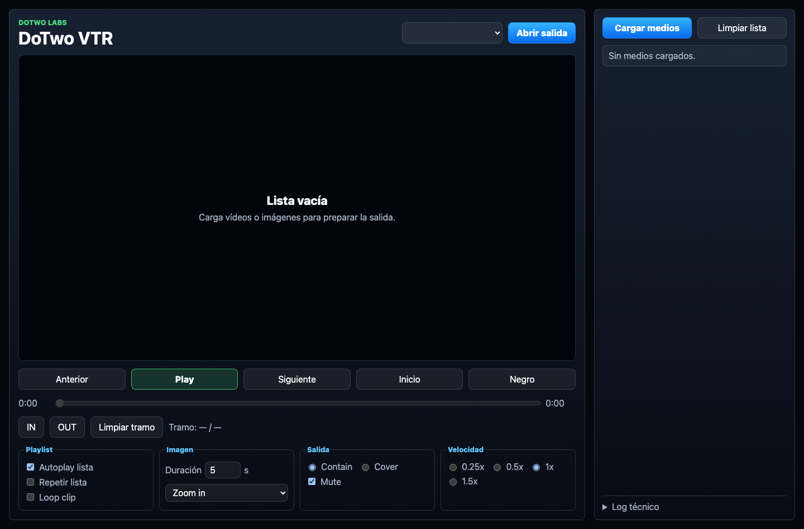

# DoTwo VTR

DoTwo VTR is a local desktop VTR-style app for audiovisual labs. It imports
videos and images, prepares local playback copies with FFmpeg, and sends a clean
output window to a second display.



## What it does

- Copies selected media into the app's local staging folder.
- Analyzes sources with FFprobe.
- Converts videos to MP4 H.264/AAC 1080p50 for reliable playback.
- Normalizes still images to 1920x1080.
- Plays a playlist of videos and images.
- Sends output to a fullscreen secondary display window.
- Supports black output, play/pause, IN/OUT marks, autoplay, repeat list, clip
  loop, image duration, and soft Ken Burns-style image effects.

## Development

```bash
npm install
npm run fetch:ffmpeg
npm run electron
```

During development, if bundled FFmpeg binaries are not present, the app tries
to use `ffmpeg` and `ffprobe` from the system PATH.

## Validation

```bash
npm run check
```

## Brand assets

The logo and macOS icon are generated from deterministic HTML sources so the
app can keep the same visual language as the other DoTwo desktop tools.

```bash
npm run brand:build
```

## macOS builds

```bash
npm ci
npm run fetch:ffmpeg
npm run check
npm run check:mac-signing
npm run build:dmg-background
npm run release:mac:signed -- --all --prepare-only
```

The signed workflow creates separate Apple Silicon (macOS 12+), modern Intel
(macOS 10.15+), and legacy Intel (macOS 10.13+) candidates. Resume each
candidate to notarize and verify its app, DMG and optional app ZIP. The legacy
build uses Electron `26.6.10`; the modern builds use Electron `31.7.7`.
See `docs/DISTRIBUTION.md` for the release procedure. The old local beta
packages are not the signed release artifacts.

## License

DoTwo VTR is licensed under Apache-2.0. FFmpeg and FFprobe are third-party tools
with their own licensing terms; see `THIRD_PARTY_NOTICES.md`.
